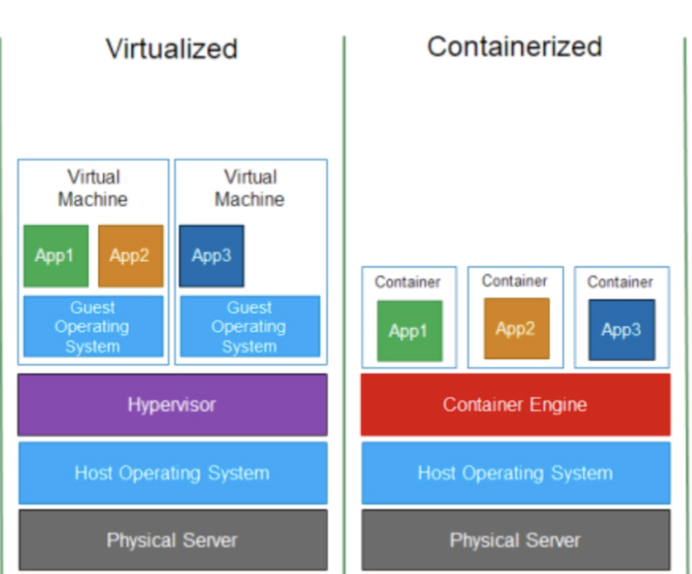

# containers-in-depth

### Containers:
  - Containers are a form of operating system virtualization.
  - To containerize the application with its libraries/dependencies to run application anywhere and anytime.
  - Containerization is considered to be a lightweight version of virtualization as compared to VMs.



### Linux features used in containerization:

#### Namespace: 
   ```
   Namespaces are a feature of the linux kernel that partitions kernel resources such that one set of processes sees one set of resources while another set of processes sees a different set of resources.
   In simple words, namespaces isolate processes from each other or you can also say namespaces restrict what a process can see.
   ```

   - Different types of namespaces:
        1. **PID namespace**: <br>
        Assigns a set of PIDs to processes that are independent from the set of PIDs in other namespaces. 
        eg: first process created in a new namespace has `PID 1` and child processes are assigned subsequent PIDs. If a child process is created with its own PID namespace, it has `PID 1` in that namespace as well as its PID in the parent process namespace.
        2. **Network namespace**: <br>
        To run programs on any port without conflicting it with what’s already running.
        3. **Mount namespace**: <br>
        To mount and unmount filesystems without affecting the host filesystem.
        4. **IPC namespace**: <br>
        To have its own IPC resources, for example POSIX message queues.
       
   - you can use [unshare](https://man7.org/linux/man-pages/man1/unshare.1.html) linux command to create namespaces.
   
#### Cgroups:
   ```
   A control group (cgroup) is a linux kernel feature that limits and isolates the resource usage (CPU, memory, disk I/O, network etc) of a collection of processes.
   In simple words, we use cgroups to control how much of a given key resources (CPU, memory, network, and disk I/O) can be accessed or used by a process.
   ```


1. [ContainersFromScratch](https://github.com/lizrice/containers-from-scratch/blob/master/main.go)
   - building basic container from scratch in Go
   - involves linux concepts like namespaces, cgroups, chroot etc.